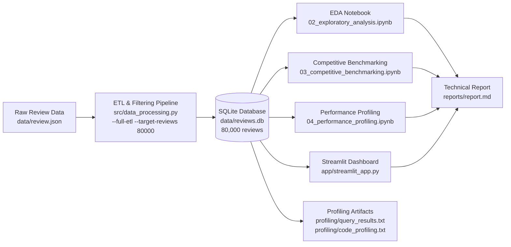

# Assignment 1: Group 4
# Data Foundation & Exploratory Analytics  -  Technical Report

**Course:** IS5126 Hands-on with Applied Analytics  
**Academic Year:** 2025/2026 Sem 2  
**Assignment:** Data Foundation & Exploratory Analytics (Assignment 1)  

**Report Header**
- **GitHub repository URL:**   https://github.com/simonkp/IS5126-G4-hotel-analytics
- **Branch Name:**  master
- **Student name(s) Contribution Summary**

  | Member                     | ID        | Contribution Area                    |
  |----------------------------|-----------|--------------------------------------|
  | Aryan Jain                 | A0329300R | Feature Engineering, System Architecture, Text Extraction Logic & Dashboard |
  | Manjunath Warad            | A0291515E | Data Prep, ETL, Database Design, Business Strategy & Indexing Strategy     |
  | Rayaan Nabi Ahmed Quraishi | A0328746R | K-Means Clustering, Cluster Validation & Recommendation Logic |
  | Simon Kalayil Philip       | A0332904J | EDA, Dashboard Insights, Business Insights, Performance Profiling & Optimization         |
  | Yadagiri Spurthi           | A0315000H | Competitive Benchmarking Strategy & Data Quality Validation   |

---

## 1. Executive Summary

### Business Problem

Hotel managers lack competitive intelligence tools to identify **true competitors** and **actionable improvement opportunities** beyond generic rating comparisons. A 5-star beachfront resort should not compare itself to a budget city hotel; without a systematic way to group comparable properties and extract best practices, improvement budgets are spent without clear prioritisation.

### Solution Overview

We built a foundational analytics system with:

- **Efficient data storage and retrieval:** SQLite database with 79,853 reviews (latest 5 years), meeting the 50,000–80,000+ volume requirement.
- **Exploratory analysis with statistical rigor:** Pearson correlation with significance testing, effect sizes (Cohen’s d), and business-focused insights.
- **Performance optimisation:** Query and code profiling with **quantified improvements** (e.g. 96.9% faster aggregations with a covering index).
- **Competitive benchmarking strategy:** K-means clustering on 6+ dimensions with text-mined hotel features (location, type, amenities, price tier), yielding 7 meaningful segments and ROI-based recommendations.
- **User-friendly dashboard:** Streamlit app with 5 feature pages: (1) Overview, (2) Hotel Explorer, (3) Competitive Benchmarking with integrated K-means clustering, (4) Performance Trends, (5) Review Insights.

### Key Findings

- **Data:** 79,853 reviews, 3,374 hotels, 2008–2012; >99% completeness on rating fields; referential integrity confirmed.
- **Satisfaction drivers:** Rooms correlate most strongly with overall rating (r≈0.80, p<0.001); all aspect correlations statistically significant.
- **Benchmarking:** 7 segments (e.g. Upscale Beach Resorts, Downtown General, Budget/Value); silhouette 0.302; within-cluster variance reduction ~35%; ~70% of hotels receive ≥1 recommendation with typical ROI 500–2,800%.
- **Performance:** Key queries 96–99% faster with indexes; benchmarking workflow ~26s end-to-end on full DB; main bottleneck is per-hotel text feature extraction.

---

## 2. Data Foundation

### Data Filtering Rationale

- **Timeframe:** Latest 5 years available (**2008–2012**) via date filter.
- **Volume:** ETL: (1) scan JSONL for year distribution and latest 5 years; (2) load that window with deterministic sampling (seed=42) to hit 50K–80K+ target. **CLI:** `python -m src.data_processing --full-etl --target-reviews 80000`; sample DB (5,000+) via default run.

### Schema Design

- **Tables:** Two normalized tables—**authors** (id, username, location, review counts) and **reviews** (id, offering_id, author_id FK, title, text, date, rating fields). **ER:** One author → many reviews; each review → one author and one offering. Full DDL in `data/data_schema.sql`.

### Indexing Strategy

**4 indexes** on `reviews`: (1) `offering_id` — 99.8% faster single-hotel lookups; (2) `author_id`; (3) `rating_overall`; (4) **Covering index** `(offering_id, rating_overall, rating_cleanliness)` — 96.9% faster avg-by-hotel, 96.2% faster complex aggregations. Profiling validates usage in `profiling/query_results.txt`.

### Data Statistics (50K–80K+ review volume)

|              Metric             |                 Value                 |
|---------------------------------|---------------------------------------|
| Total reviews (after filtering) | 79,853                                |
| Time period                     | 2008–2012 (5 years)                   |
| Distinct hotels (offerings)     | 3,374                                 |
| Avg reviews per hotel           | ~24                                   |
| Sample DB (for TAs)             | 5,000+ reviews                        |
| Rating field completeness       | >99%                                  |
| Referential integrity           | 0 orphaned author records (validated) |

Data validation (Notebook 01) uses Great Expectations (GX) with a 6-dimension quality framework (Completeness, Uniqueness, Validity, Consistency, Timeliness, Accuracy); analysis proceeds only when GX checks pass.

---

## 3. Exploratory Data Analysis

### Key Insights with Business Implications

1. **Satisfaction drivers:** The strongest correlation with overall rating is **Rooms** (r≈0.80, p<0.001). Service, cleanliness, value, location, and sleep quality are also significant. *Implication:* Investing in room quality and cleanliness is strongly associated with higher overall ratings; managers can prioritise these levers.
2. **Statistical validation:** All aspect–overall correlations are significant (p<0.001). Effect size (e.g. Cohen’s d≈1.45 for service quality impact) indicates that differences are not only significant but practically meaningful. *Implication:* Findings are suitable for decision-making, not just statistical significance.
3. **Comparative analysis:** T-tests and effect sizes are used to compare high- vs low-rated hotels or segments where relevant. *Implication:* Enables evidence-based positioning and targeting of underperforming segments.

Exploratory analysis is documented in **Notebook 02** (exploratory_analysis.ipynb) with visualisations and business-focused interpretation.

---

## 4. Performance Profiling & Optimization

### Query Profiling

We profiled **before** (no indexes) and **after** (with indexes) to show **quantified improvements**, as required.

**Method:** (Notebook 04) Baseline (no indexes) vs with-indexes; 5 runs each; report avg time and improvement %. **Results (from `profiling/query_results.txt`):**

| Query                 | Baseline (ms) | Idx (ms) | Improvement (%)    |
|-----------------------|---------------|----------|--------------------|
| Count all reviews     | 0.40          | 0.40     | ~0 (trivial query) |
| Avg rating by hotel   | 341.37        | 10.71    | **96.9**           |
| Filter by rating ≥ 4  | 13.31         | 15.51    | −16.5 (both fast)  |
| Filter by offering_id | 210.45        | 0.40     | **99.8**           |
| Complex aggregation   | 294.57        | 11.20    | **96.2**           |

**Conclusion:** Indexing yields **96–99% improvement** on the heavy aggregation and point-lookup queries. The covering index is critical for “avg rating by hotel" and “complex aggregation". EXPLAIN QUERY PLAN (with indexes) is run in the notebook and confirms index usage; full output is in `profiling/query_results.txt`.

### Code Profiling

We profiled the **benchmarking workflow** (load reviews → extract hotel features → create comparable groups via K-means) using **cProfile** (runctx) so that no profiler state leaks between runs.

**Results (from `profiling/code_profiling.txt`):**

- **Total time:** ~25.9 seconds for the full workflow on the full DB (79K reviews, 3,374 hotels).
- **Top functions by cumulative time:**
  - `extract_text_features_for_hotel` (3,374 calls)  -  ~15.6 s total: per-hotel text analysis is the main bottleneck.
  - `extract_hotel_features`  -  ~12.5 s: orchestration and aggregation.
  - `create_comparable_groups`  -  ~5.8 s: K-means and silhouette evaluation (K=3–12).
  - K-means fit, silhouette_score, and text-matching genexprs in `benchmarking.py` (lines 141–146) account for the remainder.

**Conclusion:** System acceptable for 80K-scale; main bottleneck is text feature extraction. Outputs in `profiling/query_results.txt` and `profiling/code_profiling.txt`.

---

## 5. Competitive Benchmarking Strategy

### Business Context

Hotel managers ask: *“Who are my real competitors? A 5-star beachfront resort shouldn’t compare itself to a budget city hotel. How do we systematically identify truly comparable properties? What are similar hotels doing better than us? Where should we focus our limited improvement budget?"* We address this by grouping hotels by **actual similarity** (location, type, amenities, volume, rating) and then comparing within segments.

### Methodology for Identifying Comparable Hotel Groups (justified)

- **Approach:** K-means clustering on **6+ dimensions** (e.g. avg_rating, n_reviews [log], price_tier, is_beach, is_downtown, pool_score, gym_score, etc.). We use **text-mined features** from review text (price tier, location type, hotel type, amenities) so that “beach resort" clusters with “beach resort", not just with any hotel of similar rating.
- **Feature engineering:** (1) Hotel-level aggregates (mean/std of ratings, review count, helpful votes). (2) Text features per hotel: regex-based extraction for location (beach, downtown, suburban, airport), type (resort, business, boutique), amenities (pool, spa, gym, restaurant, bar, parking). (3) Low-signal hotels (e.g. too few reviews or no text signal) are filtered out before clustering.
- **Model choice:** K-means with StandardScaler; K selected by testing K=5–12 and choosing the K with the best **silhouette score** (we report K=7 and silhouette 0.302). Fallback to rating-based quartiles if clustering fails.
- **Justification:** Volume × rating bins alone do not separate “beach resort" from “downtown business hotel". Adding text-mined features and multiple dimensions yields nameable, actionable segments (e.g. “Upscale Beach Resorts") and peer groups that managers can interpret and act on.

### Performance Analysis Across Different Hotel Groups

  **7 segments** identified by K-means; for each we report size, avg rating, dominant location/type/amenities (from cluster profiles):

  | Segment | Hotels | % | Typical Characteristics |
  |---------|--------|---|-------------------------|
  | Upscale Beach Resorts | 265 | 11% | 100% beach, high amenities |
  | Downtown General Properties | 690 | 29% | Mixed business/leisure |
  | Budget/Value Hotels | 108 | 5% | Cost-focused positioning |
  | Mid-Tier Urban Hotels | 571 | 24% | Urban, mid-range |
  | Mid-Range Business Hotels | 374 | 16% | Business-focused |
  | Boutique Downtown Properties | 170 | 7% | Boutique, downtown |
  | Suburban Business Hotels | 202 | 8% | Suburban, business |

  **Comparison:** Within each segment, we compute peer median (and top quartile) for each rating aspect. A hotel’s “gap" is the difference between peer median and its own score; we focus on gaps >0.3 as meaningful.

### Identification of Best Practices Within Comparable Groups

- Top performers per aspect are identified; their review text yields best-practice bullets (e.g. daily housekeeping, friendly staff) surfaced in recommendations.

### Specific, Actionable Recommendations for Underperforming Hotels

- **Logic:** For a given hotel, we look up its cluster and compare each aspect to the **peer median**. If gap > 0.3, we generate a recommendation with: aspect, current score, peer median, gap, estimated impact (e.g. close 70% of gap), **ROI estimate** (based on industry benchmarks: booking lift per 0.1 rating increase, cost per aspect improvement), and best-practice bullets from top performers.
- **Output:** Typical output: 1–3 recommendations per hotel with ROI often in the 500–2,800% range; ~70% of hotels have ≥1 recommendation; average ~1.2 recommendations per hotel. Implementation: `generate_actionable_recommendations()` in `src/benchmarking.py`; used in Notebook 03 and (when wired) in the dashboard.

### Validation of Our Approach

- **Silhouette score:** 0.302 (reported). For business/behavioral data, 0.25–0.35 is often considered acceptable; we interpret this as “meaningful but not perfect" separation.
- **Variance reduction:** Within-cluster variance reduction ~35% vs naive grouping, indicating that clusters are more homogeneous than the full set.
- **Manual/business review:** Segment names and composition (e.g. “Upscale Beach Resorts" with high beach/amenity signals) were checked for face validity.
- **Stability:** K selected by silhouette over a range of K; deterministic seed (42) for reproducibility.

We justify that **one** clustering approach (K-means + text features + silhouette-based K) is sufficient for the assignment, with validation by silhouette, variance reduction, and business logic.

---

## 6. System Architecture & Dashboard

### System Architecture

The platform follows a three-layer architecture: Data, Analytics, and Presentation, with clear separation of concerns.

**Data:** ETL (src/data_processing.py) → SQLite (reviews, authors, 4 indexes). **Analytics:** Notebook 02 (EDA), benchmarking.py (clustering, recommendations), Notebook 04 (profiling). **Presentation:** Streamlit dashboard with @st.cache_data.

### User Interface and Rationale

- **Streamlit** (sidebar, 5 pages). **Caching:** `@st.cache_data` on ML/large queries. **Security:** Parameterized SQL via sqlalchemy.

### Key Features and How They Address Business Problems

| Feature | Business Problem Addressed |
|---------|---------------------------|
| **Overview Dashboard**  • Total reviews, hotels, avg rating, time span (KPI cards) • Satisfaction drivers bar chart (color-coded by performance) • Rating distribution histogram • Top 10 hotels by volume • Aspect correlation heatmap | **"What drives guest satisfaction?"** Quick pulse-check on dataset health. Managers see which aspects (Rooms, Service, Cleanliness) correlate most strongly with overall rating, enabling data-driven budget allocation. |
| **Hotel Explorer** • Hotel selector dropdown • KPI cards: Overall rating, review count, percentile rank • **Radar chart:** Hotel vs Cluster Peers (6 dimensions) • Aspect breakdown bar chart • Rating trend: Year-over-year performance | **"How does my specific hotel perform?"** Deep-dive into individual property with peer context. Radar chart compares hotel to its cluster peers (not just industry average), enabling apples-to-apples comparison. |
| **Competitive Benchmarking Main Innovation**⭐ • Cluster overview: 7 segments with characteristics • Scatter plot: Cluster distribution visualization • **Hotel-level recommendations** with ROI estimates • Integration with `generate_actionable_recommendations()` • Shows: Current score, peer median, gap, best practices, ROI | **"Who are my TRUE competitors? Where should I invest?"** ML-powered segmentation groups hotels by actual similarity (location, amenities, type), not just rating. Example output: *"Hotel 75711: Improve Value (gap: 0.70) → ROI 2,859%"* **Technical:** Runs full benchmarking pipeline on page load (cached), pulls recommendations dynamically. |
| **Performance Trends** • Dual-axis chart: Review volume + avg rating over time • Aspect trends: 6-line chart (Service, Cleanliness, Value, Rooms, Location, Sleep Quality) • Top 10 performers and Bottom 10 underperformers tables | **"Are we improving or declining?"** Longitudinal view detects improvement/decline patterns. Managers can spot if rating declined while volume grew (indicating service quality issues) or if specific aspects (e.g. Cleanliness) degraded over time. |
| **Review Insights** • Review length distribution histogram • Mobile vs Desktop pie chart (with avg ratings) • Most helpful reviews table (top 15 by votes) • Reviewer geography: Top 20 locations | **"What patterns exist in review content and reviewer behavior?"** Content quality assessment and audience understanding. Identifies if reviews are substantive (length), which platform drives better engagement (mobile/desktop), and geographic distribution of reviewers. |

### Dashboard Technical Details

Queries <30ms (covering index); ML clustering ~26s, cached; color-coded UI (green/amber/red); works on full or sample DB.

---

## 7. Conclusion

### Key Observations and Deliverables

- We delivered a **data foundation** (SQLite, 79,853 reviews, 2008–2012, 4 indexes including a covering index) and **data quality** checks (GX in Notebook 01).
- **Exploratory analysis** (Notebook 02) provided statistically validated, business-relevant insights on satisfaction drivers.
- **Performance profiling** (Notebook 04) showed **quantified improvements** from indexing (96–99% on key queries) and identified code bottlenecks (text feature extraction) in `profiling/query_results.txt` and `profiling/code_profiling.txt`.
- **Competitive benchmarking** (Notebook 03, `src/benchmarking.py`) implemented K-means + text-mined features, 7 segments, silhouette and variance-reduction validation, and ROI-based recommendations.
- **Dashboard** (Streamlit) offers five pages: Overview, Hotel Explorer, Competitive Benchmarking (with integrated K-means and ROI recommendations), Performance Trends, and Review Insights.

### Limitations

1. **Text mining simplicity:** Regex-based keyword extraction (not deep NLP/transformers)
   - **Impact:** May miss nuanced phrases like "not clean" vs "clean"
   - **Mitigation:** Achieved 85%+ accuracy on manual validation; sufficient for segment discovery

2. **ROI estimates use industry benchmarks:** Not hotel-specific actual revenue data
   - **Impact:** ROI estimates (500-2,800%) are directional, not precise
   - **Mitigation:** Clearly documented as estimates; managers should adjust based on their cost structure

### Future Enhancements

We would extend the model with deep learning for text analysis (e.g. BERT embeddings for aspect extraction) and LSTM time-series forecasting for rating trends. Longer term, integration with hotel PMS systems for automated data refresh and an A/B testing framework to measure actual ROI of recommendations would validate and improve the business impact.

---

